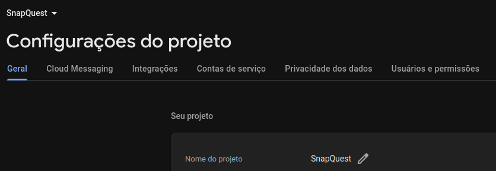
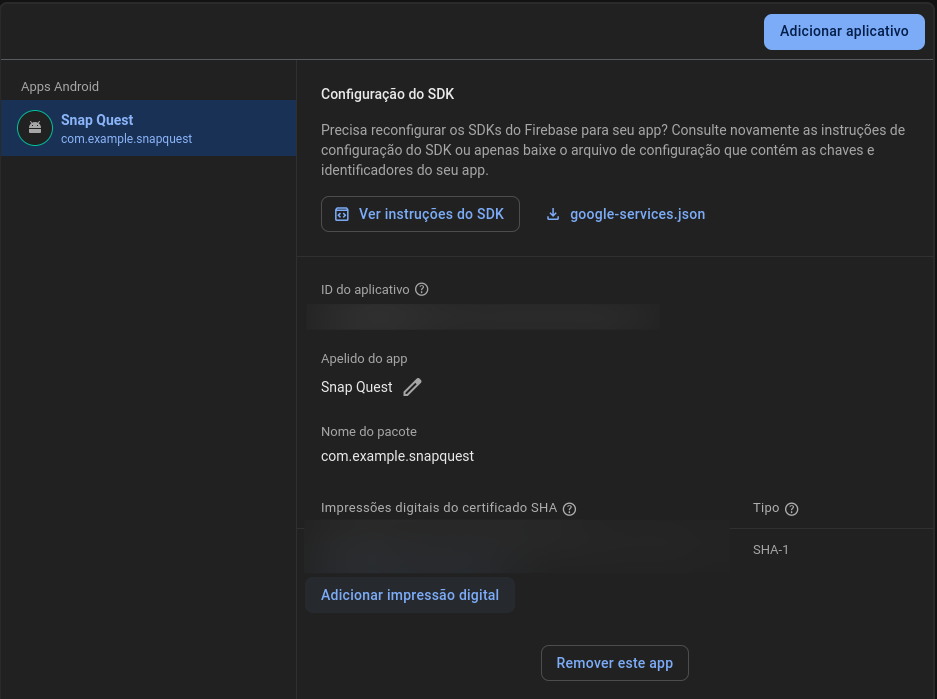

# SnapQuest

<p align="center">
  
  <h1 align="center">SnapQuest Peddy-paper app - Android project for ICM classes</h1>
  
</p>
<hr/>

## About the project
SnapQuest helps users discover more about a place by learning in a creative and fun way. It transforms sightseeing into a real life treasure hunt. To learn more about the place, the user will have to take several pictures, each one from different areas of the place, where each area will have some information to get to know the place, like a peddy-paper.
## Structure
```
.
├── SnapQuest.apk
├── README.md
└── SnapQuest
    ├── app
    ├── build.gradle.kts
    ├── gradle
    ├── gradle.properties
    ├── gradlew
    ├── gradlew.bat
    ├── local.defaults.properties
    ├── local.properties
    ├── secrets.properties
    └── settings.gradle.kts
```
The `SnapQuest` directory holds the **Android Project** itself.\
The `SnapQuest.apk` is an apk ready to run.

## Architecture


## Enable google auth with firebase

### **Get SHA1 key from Android Studio**

Follow [this](https://medium.com/@mr.appbuilder/how-to-get-sha1-key-in-android-studio-current-version-or-newversion-cb90814c14cd) tutorial to obtain your SHA1 key

### **Add your key to the Firebase project**

Access [FireBase Configurations](https://console.firebase.google.com/project/snapquest-56a72/settings/general/android:com.example.snapquest?hl=pt-br)


Scroll down until you find


Click on "Adicionar impressão digital" and insert your SHA1 key.


Then save

## Configure Maps API

If the project doesn't load the map correctly generate a new key following [this tutorial](https://developers.google.com/maps/documentation/android-sdk/get-api-key) and replace it into `secrets.properties` on `MAPS_API_KEY= ... `
